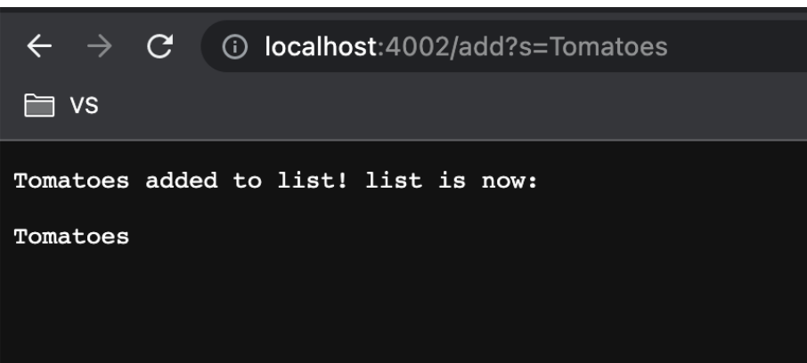
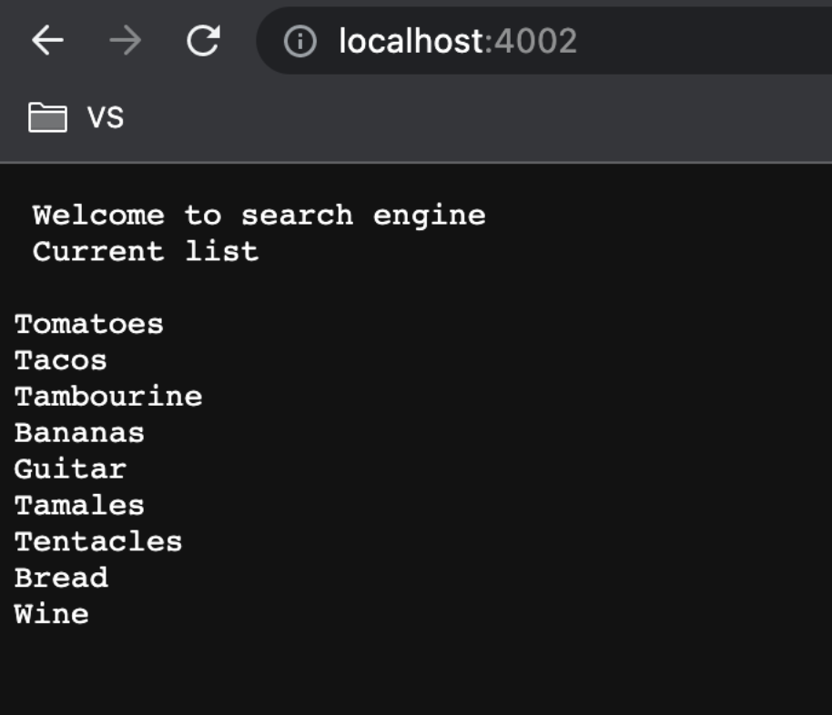
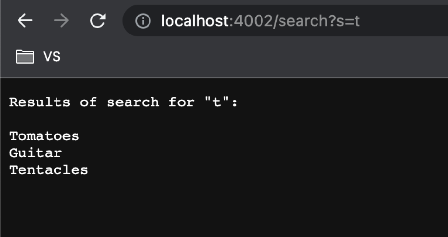
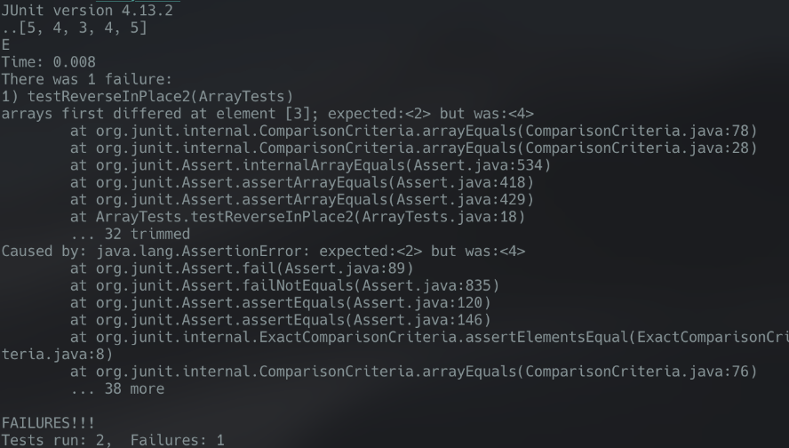
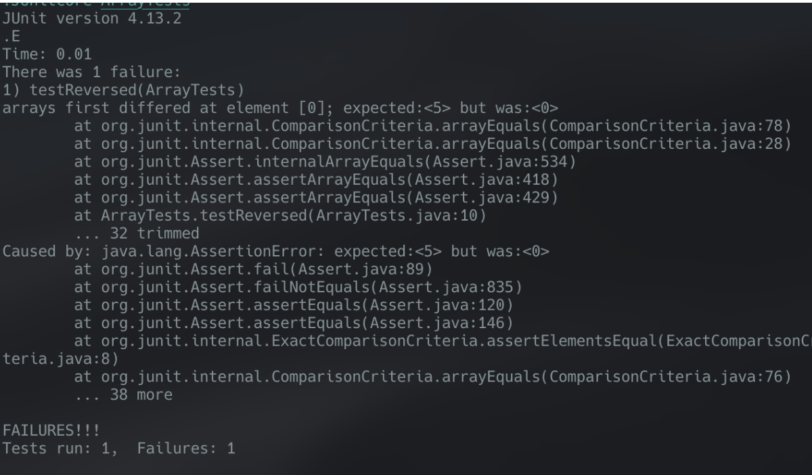

Part 1. 

i) code


```
import java.io.IOException;
import java.net.URI;
import java.util.ArrayList;

class Handler implements URLHandler {
    // The one bit of state on the server: a number that will be manipulated by
    // various requests.
    ArrayList<String> strings = new ArrayList<String>();
    public static String AL_TO_S(ArrayList<String> ss){
	String news = ""; 
    	for(String s : ss){
	    news  += "\n" +  s;
	}
	return news;
    }

    public String handleRequest(URI url) {
        if (url.getPath().equals("/")) {
            return String.format(" Welcome to search engine\n Current list\n "+AL_TO_S(strings));
        } else if (url.getPath().equals("/increment")) {
            //  num += 1;
            return String.format("Number incremented!");
        } else {
            System.out.println("Path: " + url.getPath());
            if (url.getPath().contains("/add")) {
                String[] parameters = url.getQuery().split("=");
                if (parameters[0].equals("s")) {
                    //  num += Integer.parseInt(parameters[1]);
		    strings.add(parameters[1]);
                    return String.format(parameters[1] + " added to list! list is now:\n" + AL_TO_S(strings));
                }
            }

            if (url.getPath().contains("/search")) {
                String[] parameters = url.getQuery().split("=");
                if (parameters[0].equals("s")) {
                    //  num += Integer.parseInt(parameters[1]);
    		    ArrayList<String> strList = new ArrayList<String>();
		    for(String s: strings){
		        if(s.contains(parameters[1])){strList.add(s);}
		    }
                    return String.format("Results of search for \"" + parameters[1] + "\": \n"  + AL_TO_S(strList));
                }
            }
            return "404 Not Found!";
        }
    }
}

class SearchEngine {
    public static void main(String[] args) throws IOException {
        if(args.length == 0){
            System.out.println("Missing port number! Try any number between 1024 to 49151");
            return;
        }

        int port = Integer.parseInt(args[0]);

        Server.start(port, new Handler());
    }
}

```


ii) 





The only method that is called is handleRequest, what it takes is the URL, it checks if the path contains ‘/add’ it will then split the parameter into an array of the string delimited by ‘=’, and if the the 0th index of that array is s, it will add the 1st index of that array to the arraylist strings, and display.





The only method called is handleRequest, it takes the URL, it will check if the path is simply ‘/’ if so it will return the home which is above, which simply prints the contents of arraylist strings without changing anything





The only method that is called is handleRequest, what it takes is the URL, it checks if the path contains ‘/search it will then split the parameter into an array of the string delimited by ‘=’, if the 0th index of the string is ‘s’ it will then filter the arraylist strings into a new one called strList, only adding the ones containing the 1st index of the array (path delimited by ‘=’), it will then print the contents of strList.

Part 2.

1)

i)


```
	@Test 
	public void testReverseInPlace2() {
		int[] input1 = {1,2,3,4,5 };
		ArrayExamples.reverseInPlace(input1);
		System.out.println(Arrays.toString(input1));
		assertArrayEquals(new int[]{ 5,4,3,2,1 }, input1);
	}
```


ii) I can’t replicate the bug as I have already fixed the code, but it would be something like 

Expected [5,4,3,2,1] received [1,2,3,1,2]





iii) The bug fix needed is to create a new array to write the looped numbers into, and then add them back into the original array, because if you edit it in place while looping through it you will change the elements you need to


```
  // Changes the input array to be in reversed order
  static reverseInPlace(int[] arr) {
	int[] tempArr = new int[arr.length];
    for(int i = 0; i < arr.length; i += 1) {
      tempArr[i] = arr[arr.length - i - 1];
    }
    for(int i = 0; i < arr.length; i += 1) {
      arr[i] = tempArr[i];
    }
	
  }
```


iv)  If you’re changing the elements of one end of the array while looping through the other, you will overwrite numbers you needed to access to complete the reversal of the array.

2)

i)`  `


```
	@Test 
	public void testReversed() {
		int[] input1 = {1,2,3,4,5 };
		int[] x= ArrayExamples.reversed(input1);
		assertArrayEquals(new int[]{ 5,4,3,2,1 }, x);
	}
```


ii) I can’t replicate the bug as I have already fixed the code, but it would be something like 

Expected [5,4,3,2,1] received [1,2,3,4,5]





iii) the bug fix is to switch the references to newArr and arr, as the method currently functionally does nothing, it adds values to a newArray but does nothing with it and just returns the input parameter arr.


```
  static int[] reversed(int[] arr) {
    int[] newArray = new int[arr.length];
    for(int i = 0; i < arr.length; i += 1) {
      newArray[i] = arr[arr.length - i - 1];
    }
    return newArray;
  }
```


iv) because it returns arr, and in the function modifies newArray, regardless of what you put into the parameter, you will receive arr, since it does not get modified at all inside the method.
