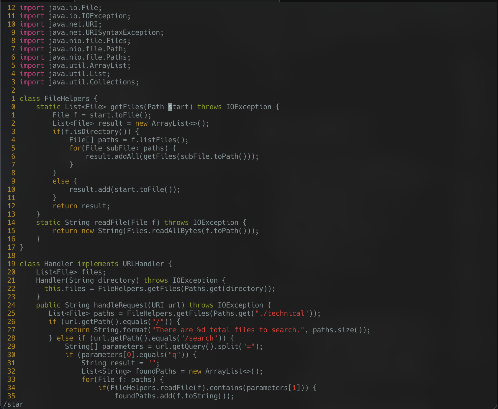
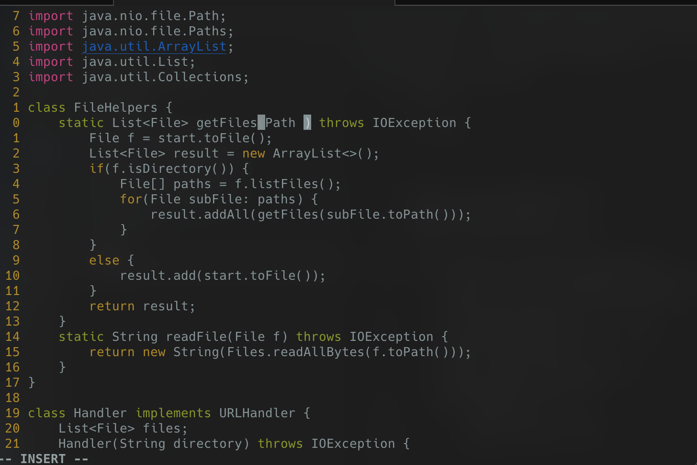
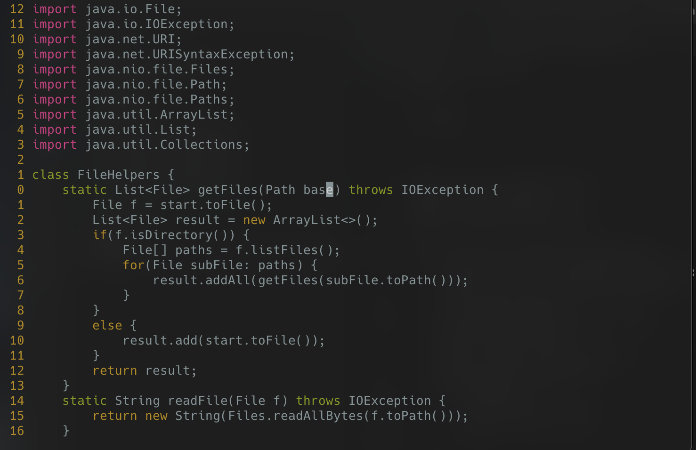
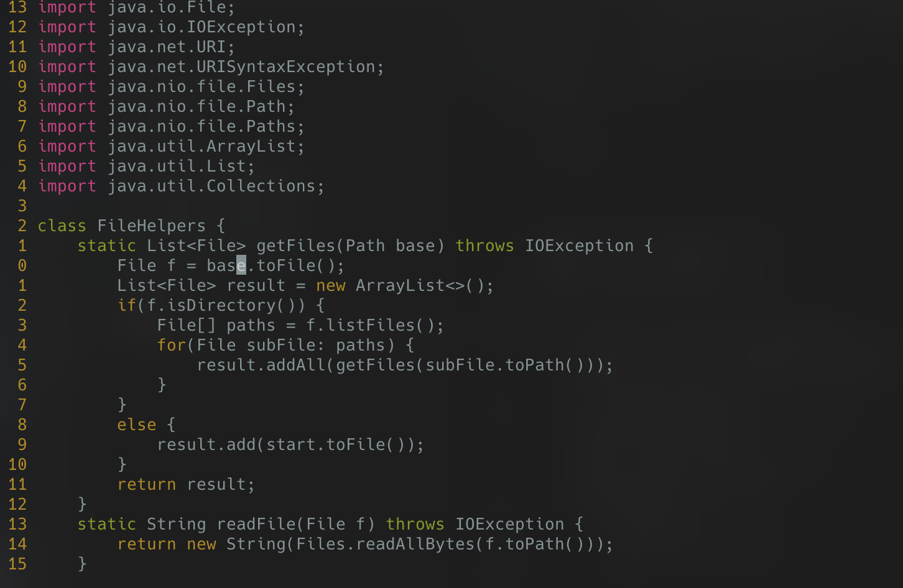
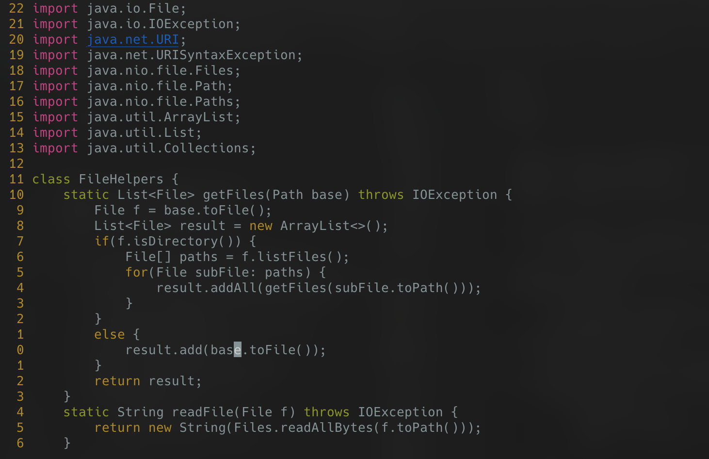
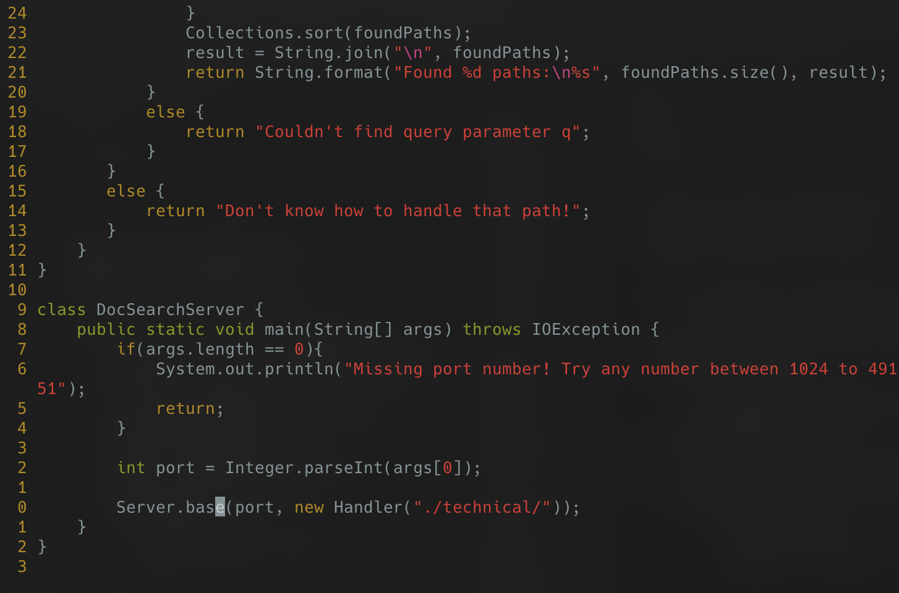
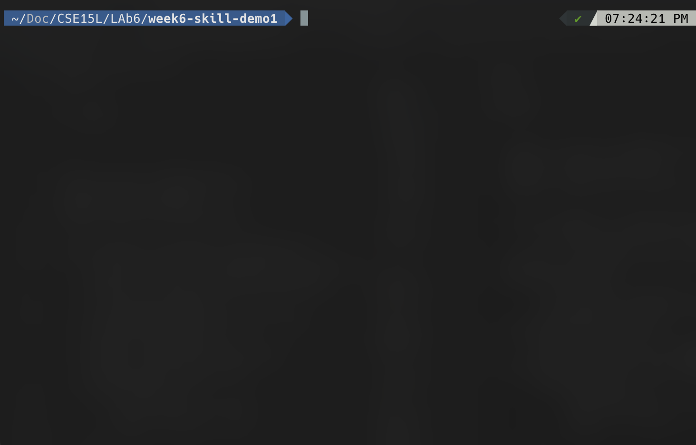

# Lab Report 3

## Part 1
I did replace star with base

`/star<Enter>5sbase<Esc>n.n.n.<Shift>ZZ`

22 Strokes

Search for star using `/star` 

Delete 5 characters and go into insert with `5s`

Write base and escape with `base<Esc>`

Do `n.` to go to next occurence of star and repeat delete and replace with base (do this 3 times)

Do `<Shift>ZZ` to exit and save

## Part 2

It took me 2:03 minutes with vscode and around 10 seconds with just vscode.

While it was easier to do it in Vim I think it was kind of cheating since I had already mastered and practiced the perfect keystrokes to do it and I was already logged in to the SSH shell when I began timing. I think if I would have done the opposite, where I practiced editing in vscode and scping, the times would have been around the same.

Still for quick script edits I would say I do prefer VIM as I already used it before learning in this course and have found it very helpful. 

If it was a larger project however I would prefer to download it and work on it with an IDE so I could maneuver around files easier and potentially preview the project in real time, it varies a lot depending on the task I would want to do.